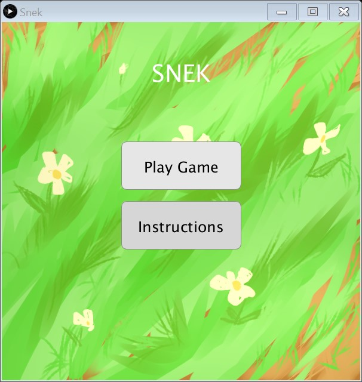

## Authors
* **Qianqian Feng** - _Contributor_  
* **William Li** - _Contributor_  
* **Manahil Masroor** - _Contributor_  
* **David Huynh** - _Contributor_ 

# CSC209-snek
An interpretation of the classic snake game. Playable for a single player. 

## Screen Shots
 
 

 
 

## Installation
WINDOWS
Download and run the executable file

## How to Play
- The home screen contains Play, Exit and Instruction buttons:
  - Click on play if you wish to be sent to where the game takes place
  - Click instructions if you do not know how to play
  - Click exit to close the application
- The gameplay screen contains XY buttons:
  - Click pause to stop the game for as long as you need
  - The user will be sent to the gameover screen when the Snek's head collides with either the sides of the screen or itself
  - There is no "win condition", try to get your score as high as possible!
- The game over screen contains the Menu button:
  - The Game Over message appears here
  - Click the Menu button to be returned back to the menu where you can restart your game or look at instructions

## Built With
* [Processing](https://processing.org/)

## License
This project is licensed under the MIT License - see the LICENSE.md file for details
